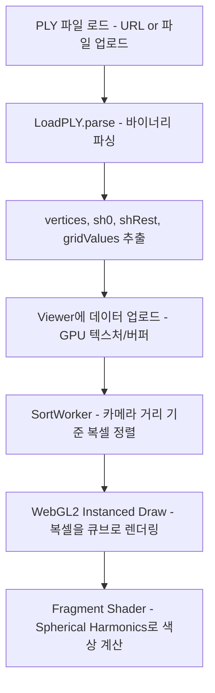

# SVRaster WebGL Viewer 분석

## 개요

Nvidia의 **Sparse Voxels Rasterization (SVRaster)** 논문에서 나온 복셀(voxel) 장면을 웹 브라우저에서 인터랙티브하게 시각화하는 **WebGL2 기반 뷰어**입니다. TypeScript + Vite로 구성되어 있으며, 데모는 [vid2scene.com/voxel](https://vid2scene.com/voxel)에서 확인 가능합니다.

- 원본 저장소: https://github.com/samuelm2/svraster-webgl
- 참고 논문: https://svraster.github.io/

---

## 기술 스택

| 항목 | 내용 |
|------|------|
| 언어 | TypeScript (91%), Python (7%), CSS, HTML |
| 번들러 | Vite |
| 3D 수학 | `gl-matrix` |
| 렌더링 | WebGL2 (Instanced Rendering) |
| 빌드 | Node.js + npm |

---

## 프로젝트 구조

```
src/
├── main.ts               — 앱 진입점 (UI, 진행 바, PLY 로딩 조율)
├── style.css
├── lib/
│   ├── Viewer.ts         — WebGL2 렌더러 (핵심 클래스)
│   ├── Camera.ts         — 뷰/투영 행렬 관리
│   ├── LoadPLY.ts        — PLY 파일 파서 (바이너리 포맷)
│   ├── DistanceSorter.ts — 카메라 거리 기반 복셀 정렬 (Radix Sort)
│   └── MortonSorter.ts   — Morton 코드 기반 정렬 (대안적 방식)
└── workers/
    └── SortWorker.ts     — Web Worker로 비동기 정렬 처리

scripts/
└── convert_to_ply.py     — SVRaster .pt 모델을 PLY로 변환하는 Python 스크립트
```

---

## 핵심 동작 흐름



---

## 핵심 기술 포인트

### 1. PLY 데이터 구조
각 복셀마다 다음 데이터를 저장합니다:
- `vertices` — 위치 (x, y, z)
- `sh0Values` — 기본 색상 (SH degree 0)
- `shRestValues` — 방향성 색상 (SH degree 1, 계수 9개)
- `octlevels` / `octpaths` — 옥트리 레벨 및 경로 (복셀 크기 계산용)
- `gridValues` — 격자 밀도값 (density)

### 2. 거리 기반 정렬
논문의 Morton 코드 방식 대신 카메라 거리 기반 **Radix Sort**를 사용합니다.
- 정렬은 `SortWorker.ts`에서 Web Worker로 비동기 처리
- 카메라가 일정 거리 이상 이동했을 때만 재정렬하여 성능 최적화

### 3. Instanced Rendering
수십만 개의 복셀을 단일 Draw Call(`drawElementsInstanced`)로 렌더링합니다. GPU 텍스처에 복셀 속성을 업로드하고 Fragment Shader에서 참조합니다.

### 4. Spherical Harmonics (SH)
SH degree 1 기준 복셀당 12개 계수(SH0: 3개 + SH1: 9개)로 시점 방향에 따른 색상을 표현합니다.

### 5. 씬 좌표계 변환
Y축, Z축 반전 행렬(`sceneTransformMatrix`)을 적용해 SVRaster 학습 좌표계와 WebGL 좌표계 차이를 보정합니다.

---

## 카메라 컨트롤

| 입력 | 동작 |
|------|------|
| 좌클릭 + 드래그 | 카메라 궤도(Orbit) |
| 우클릭 + 드래그 | 카메라 패닝(Pan) |
| 마우스 휠 | 줌 인/아웃 |
| WASD / 방향키 | 카메라 이동 |
| Q / E | 씬 회전 (시선 방향 기준) |
| Space / Shift | 위/아래 이동 |
| 터치 1손가락 드래그 | Orbit (모바일) |
| 터치 2손가락 드래그 | Pan / Zoom (모바일) |

---

## URL 파라미터

| 파라미터 | 설명 |
|----------|------|
| `?samples=N` | Fragment Shader 밀도 샘플 수 (기본값: 8, 낮출수록 성능↑) |
| `?url=<PLY URL>` | 외부 PLY 파일 URL 로드 |
| `?showLoadingUI=true` | 파일 업로드 UI 표시 |
| `?quality=detail` | 디테일 우선 프리셋. 기본 샘플 수를 높이고 density transfer를 더 날카롭게 설정 |
| `?renderScale=1` | 내부 렌더 해상도 배율. 낮추면 FPS↑, 높이면 선명도↑ |

---

## 성능 특성

- Laptop 3080 GPU: ~60–80 FPS
- iPhone 13 Pro Max: ~12–20 FPS

---

## 제한사항

- SH degree 1만 지원 (복셀당 최대 12개 계수)
- 양자화/압축 없음 → PLY 파일이 매우 큼
- 논문의 Ray direction-dependent Morton ordering 미구현
- Fragment Shader가 현재 성능 병목

---

## 로컬 실행 방법

```bash
# 의존성 설치
npm install

# 개발 서버 실행 (http://localhost:5173)
npm run dev

# 빌드
npm run build
```

---

## 나만의 SVRaster 씬 생성

```bash
# 1. SH degree 1로 학습
python train.py \
  --source_path /PATH/TO/COLMAP/SFM/DIR \
  --model_path outputs/pumpkin/ \
  --sh_degree 1 \
  --sh_degree_init 1 \
  --subdivide_max_num 600000

# 2. PLY 포맷으로 변환
python scripts/convert_to_ply.py outputs/pumpkin/model.pt outputs/pumpkin/pumpkin.ply
```
